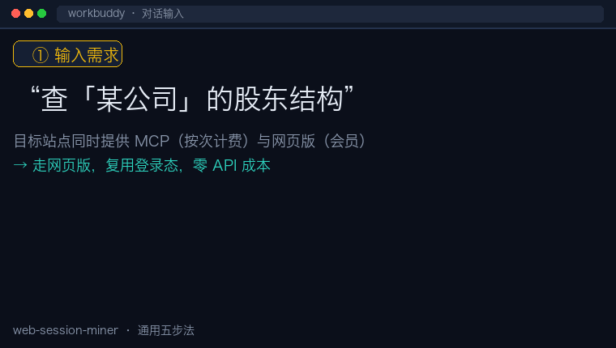

# Web Session Miner

复用浏览器登录态，把「人肉复制粘贴」变成程序化采集网页版数据的**通用方法论 SKILL**。

## 这是什么

本 SKILL 通过 **browser-skill（bsk CLI）** 驱动你真实浏览器，复用已登录的登录态抓取网页版数据，
把「人肉复制粘贴」变成程序化采集。只要网站有「**网页版 + 会员登录态**」就适用。

当网站**同时提供**「官方 MCP / API（按次计费）」和「网页版（会员展示）」时，还能额外
**绕开 API 积分计费**，用「已付费的会员权益」零 API 成本拿到全量深度数据。

采用「**通用方法论 + 站点适配器（recipes）**」可插拔架构：

```
web-session-miner/
├── SKILL.md              # 通用五步法 + 合规边界 + 坑位清单
├── README.md             # 本文件
├── LICENSE               # MIT
├── AUDIT.md              # 脱敏核对表（脱敏基线 + 自查清单）
└── recipes/
    ├── _template.md      # 新站点适配模板（照填即可接入新网站）
    ├── qcc.md            # 企查查适配器（内置示例，未登录可搜索）
    └── tyc.md            # 天眼查适配器（搜索强制登录，已跑通）
```



## 使用场景

| 场景 | 你要查什么 | 说明 |
|------|-----------|------|
| 供应商资质背调 | 工商信息、实控人、风险 | 认证/采购前核实对方资质 |
| 投资标的股权穿透 | 股东结构、最终受益人 | 穿透多层股权看清实际控制 |
| 竞品分析 | 对外投资、分支机构 | 摸清对手业务布局 |

> 演示 GIF 与场景描述均使用占位符（"某公司""某某"等），不含任何真实企业/人物数据。

## 快速开始

1. **装依赖**：安装 `browser-skill`（bsk CLI + Chromium 扩展，扩展需显示已连接）。
2. **登录目标站点**：在浏览器里登录你已付费的会员账号（如企查查 SVIP）。
3. **触发 SKILL**：对话中说「查 XX 公司的股东/实控人」「做 XX 人物的投资关系图谱」等，
   agent 会自动走五步法抓取。
4. **换站点**：复制 `recipes/_template.md` → 填 6 项 → 即可接入天眼查、爱企查、国家公示系统等。

## 适用 / 不适用

- ✅ 适用：你**已付费/已授权**的「MCP + 网页版并存」数据站点（企业工商、人物图谱、股权穿透等）。
- ❌ 不适用：绕过付费墙获取**未授权**数据、大规模商业爬取、违反目标站点 ToS/robots 的用途。

## 依赖

- **browser-skill**：WorkBuddy / CodeBuddy 生态的浏览器自动化 skill，提供 `bsk` CLI + Chromium
  扩展，负责复用浏览器登录态。通过 WorkBuddy 的 skill/插件市场安装（本 SKILL 不内置）。
- 目标站点的会员账号（已登录态）。

## 合规声明

> ⚠️ **本 SKILL 是「高效采集你自己已授权数据」的效率工具，不是「破解付费墙」的工具。**
>
> - ✅ 仅用于采集**你自己账号已付费/已授权**可见的数据。
> - ✅ 遵守目标网站服务条款（ToS）与 robots 协议，控制抓取频率。
> - ❌ **禁止**绕过付费墙获取未授权数据、大规模商业爬取、或任何违法用途。
> - ⚠️ 使用者对自身行为负责。

## License

MIT
